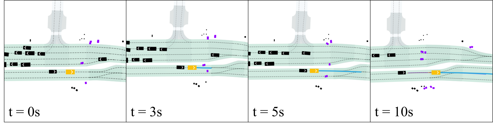
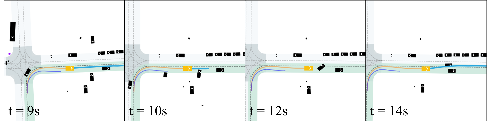
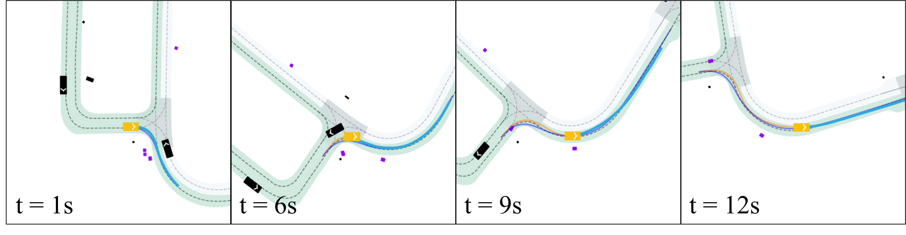
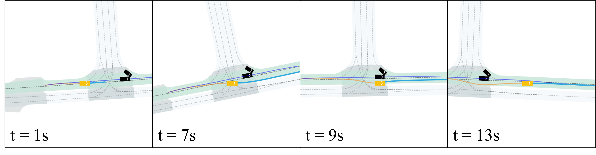
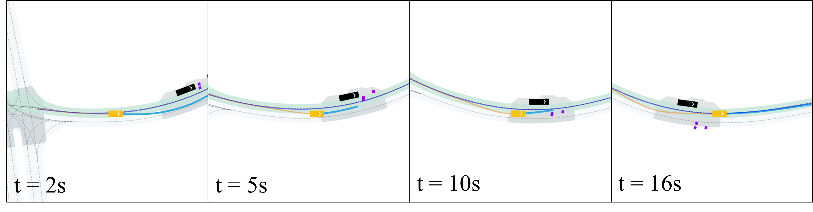

<div align="center">
<h3>Flow Matching-Based Autonomous Driving Planning</br>
with Advanced Interactive Behavior Modeling</h3>

[Tianyi Tan](https://github.com/0ttwhy4)\*, [Yinan Zheng](https://github.com/ZhengYinan-AIR)\*, [Ruiming Liang](https://github.com/LRMbbj), [Zexu Wang](https://github.com/ZexuWang), [Kexin Zheng](https://github.com/Whiterrrrr), [Jinliang Zheng](https://github.com/2toinf), [Jianxiong Li](https://facebear-ljx.github.io/), [Xianyuan Zhan](https://zhanzxy5.github.io/zhanxianyuan/), [Jingjing Liu](https://air.tsinghua.edu.cn/en/info/1046/1194.htm)


[**[Arxiv]**](https://arxiv.org/pdf/2510.11083)

*The 39th Annual Conference on Neural Information Processing Systems (NeurIPS), 2025*

</div>

The official implementation of *Flow Planner*, an advanced learning-based framework melding coordinated innovations in **data modeling**, **architecture design**, and **learning schemes** to enhance interactive driving behavior modeling for autonomous driving planning.

<div style="display: flex; justify-content: center; align-items: center; gap: 2%;">

  

  

  

</div>

<div style="display: flex; justify-content: center; align-items: center; gap: 2%;">

  

  

  

</div>


## Contents

- [Methods](#methods)
- [Closed-loop Performance](#closed-loop-performance)
    - [NuPlan](#nuplan)
    - [InterPlan](#interplan)
- [Qualitative Results](#qualitative-results)
- [Getting Started](#getting-started)

## Methods

From the data modeling perspective, we propose **fine-grained trajectory tokenization** to achieve expressive trajectory modeling. Subsequently, we design a well-curated architecture that enhances interactive behavior modeling through thorough **spatiotemporal fusion**. Finally, we adopt flow matching with **classifier-free guidance** to further enhance multi-modal and interactive driving behaviors.

<image src="assets/imgs/framework.png" width=100%>

## Closed-loop Performance

### NuPlan

**1. Learning-based Methods**

| Methods                            | Val14 (NR) | Val14 (R) | Test14-hard (NR) | Test14-hard (R) | Test14 (NR) | Test14 (R) |
| ---------------------------------- | ---------- | ----------- | ---------------- | ----------------- | ----------- | ------------ |
| PDM-Open*                          | 53.53      | 54.24       | 33.51            | 35.83             | 52.81       | 57.23        |
| UrbanDriver                        | 68.57      | 64.11       | 50.40            | 49.95             | 51.83       | 67.15        |
| GameFormer w/o refine.             | 13.32      | 8.69        | 7.08             | 6.69              | 11.36       | 9.31         |
| PlanTF                             | 84.72      | 76.95       | 69.70            | 61.61             | 85.62       | 79.58        |
| PLUTO w/o refine.*                 | 88.89      | 78.11       | 70.03            | 59.74             | **89.90**   | 78.62        |
| Diffusion-es w/o LLM               | 50.00      | -           | -                | -                 | -           | -            |
| STR2-CPKS-800M w/o refine.*        | 65.16      | -           | 52.57            | -                 | 68.74       | -            |
| Diffusion Planner                  | 89.87  | 82.80   | 75.99  | 69.22  | 89.19  | **82.93**    |
| **Flow Planner** (Ours)                | **90.43** | **83.31** | **76.47** | **70.42** | **89.88** | **82.93** |

---

**2. Rule-based / Hybrid Methods**

| Methods                              | Val14 (NR) | Val14 (R) | Test14-hard (NR) | Test14-hard (R) | Test14 (NR) | Test14 (R) |
| ------------------------------------ | ---------- | ----------- | ---------------- | ----------------- | ----------- | ------------ |
| **Expert (Log-replay)**              | 93.53      | 80.32       | 85.96        | 68.80             | 94.03       | 75.86        |
| IDM                                  | 75.60      | 77.33       | 56.15            | 62.26             | 70.39       | 74.42        |
| PDM-Closed                           | 92.84      | 92.12       | 65.08            | 75.19             | 90.05       | 91.63        |
| PDM-Hybrid                           | 92.77      | 92.11       | 65.99            | 76.07             | 90.10       | 91.28        |
| GameFormer                           | 79.94      | 79.78       | 68.70            | 67.05             | 83.88       | 82.05        |
| PLUTO                                | 92.88      | 76.88       | 80.08            | 76.88             | 92.23       | 90.29        |
| Diffusion-es                         | 92.00      | -           | -                | -                 | -           | -            |
| STR2-CPKS-800M                       | 93.91      | 92.51       | 77.54            | 82.02         | -           | -            |
| Diffusion Planner w/ refine   | 94.26  | 92.90   | 78.87            | 82.00         | 94.80   | 91.75    |
| **Flow Planner** w/ refine (ours)   | 94.31  | 92.38   | 78.64            | 80.25       | 94.79   | 92.40    |

### InterPlan

| Methods                                 | Overall Score | Nudge Around | High Traffic Density | Jaywalk  |
| --------------------------              | ----------    | ---------    | -------------------- |--------- |
| PlanTF                                  | 47.70         | 49.40        | 58.85                | 33.94    |
| PLUTO w/o refine.*                      | 58.47         | 71.56        | 67.25                | 25.48    |
| Diffusion Planner                       | 52.90         | 60.48        | 49.71                | 26.20    |
| **Flow Planner**                            | **61.82**         | 72.96        | 67.21                | 43.57    |

*\*: prior knowledge is used for the model*

## Qualitative Results

<div align="center">

  
  
  
  <h7>nuPlan Scenarios</h7>
  </br></br>

  <!-- Group 2 -->
  
  
  <h7>interPlan Scenarios</h7>

</div>

## Getting Started

### Fundamental setup
```
conda create -n flow_planner python=3.9
conda activate flow_planner
```
### install nuplan-devkit
```
git clone https://github.com/motional/nuplan-devkit.git && cd nuplan-devkit
pip install -e .
pip install -r requirements.txt
```

### flow planner setup

```
cd ..
git clone https://github.com/DiffusionAD/Flow-Planner.git && cd Flow-Planner
pip install -e .
pip install -r requirements.txt
```

### To Launch Training

1. Convert nuplan data into npz and generate corresponding data list json file as indicated in https://github.com/ZhengYinan-AIR/Diffusion-Planner.
2. Fill in the `flow_planner.script.data.dataset.nuplan_data.yaml` with generated file path.
3. Launch training with `flow_planner/run_script/launch_train.sh`

### To Launch Simulation

1. Fill the `flow_planner/run_script/launch_sim_nuplan.sh` with corresponding path and task.
2. To perform interPlan simulation, follow the instructions in https://github.com/mh0797/interPlan

## Bibtex

If you find our code and paper can help, please cite our paper as:
```
@inproceedings{
tan2025flow,
title={Flow Matching-Based Autonomous Driving Planning with Advanced Interactive Behavior Modeling},
author={Tianyi Tan and Yinan Zheng and Ruiming Liang and Zexu Wang and Kexin Zheng and Jinliang Zheng and Jianxiong Li and Xianyuan Zhan and Jingjing Liu},
booktitle={The Thirty-ninth Annual Conference on Neural Information Processing Systems},
year={2025}
}

@inproceedings{
zheng2025diffusionbased,
title={Diffusion-Based Planning for Autonomous Driving with Flexible Guidance},
author={Yinan Zheng and Ruiming Liang and Kexin ZHENG and Jinliang Zheng and Liyuan Mao and Jianxiong Li and Weihao Gu and Rui Ai and Shengbo Eben Li and Xianyuan Zhan and Jingjing Liu},
booktitle={The Thirteenth International Conference on Learning Representations},
year={2025}
}
```